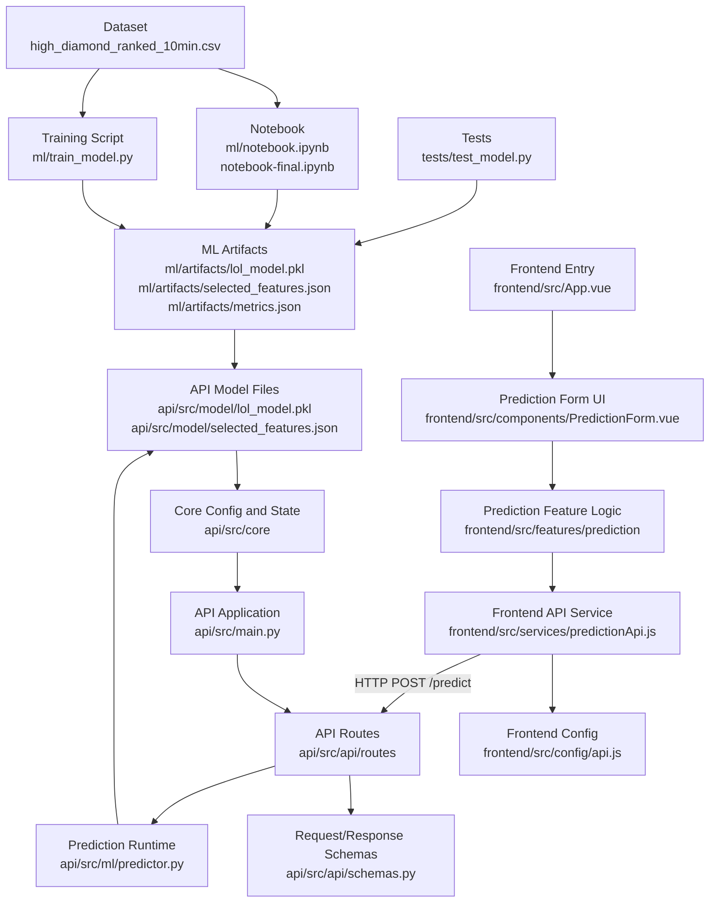

# League of Legends Win Predictor

MVP de machine learning para classificação binária utilizando o dataset [League of Legends Diamond Ranked Games (10 min)](https://www.kaggle.com/datasets/bobbyscience/league-of-legends-diamond-ranked-games-10-min/data).

O modelo prevê `blueWins` a partir de features numéricas do early game. A coluna identificadora gameId é removida, e o MVP implantado utiliza as seguintes features selecionadas:

- `blueKills`
- `redKills`
- `blueGoldDiff`
- `blueExperienceDiff`
- `blueDragons`
- `redDragons`
- `blueHeralds`
- `redHeralds`

## Estrutura do Projeto

```text
api/
  src/
    api/
      routes/
      schemas.py
    core/
      config.py
      state.py
    ml/
      predictor.py
    model/
    main.py
frontend/
  src/
    components/
      PredictionForm.vue
    config/
      api.js
    features/
      prediction/
    services/
      predictionApi.js
ml/
  train_model.py
  notebook.ipynb
  artifacts/
tests/
```

## Arquitetura



## Train Model

Coloque `high_diamond_ranked_10min.csv` na raiz do projeto.

```bash
cd api
uv run python ../ml/train_model.py
```

As dependências estão declaradas em api/pyproject.toml; o uv run utilizará o ambiente do projeto da API.

O script de treinamento realiza carregamento dos dados, divisão holdout, preparação de features, padronização para KNN e SVM, pipelines do sklearn, GridSearchCV, cross-validation, avaliação, comparação entre modelos e exportação do melhor modelo.

A normalização min-max foi intencionalmente não utilizada no pipeline final de produção. Isso não é uma omissão: as features selecionadas incluem variáveis de diferença com sinal, como blueGoldDiff e blueExperienceDiff, e o StandardScaler é a escolha de pré-processamento mais adequada para KNN e SVM porque centraliza as features e ajusta suas variâncias para uma escala comparável. Decision Tree e Gaussian Naive Bayes foram mantidos sem scaling, pois esses algoritmos não exigem normalização min-max para este problema tabular numérico.

Artefatos gerados:

- `ml/artifacts/lol_model.pkl`
- `ml/artifacts/selected_features.json`
- `ml/artifacts/metrics.json`
- `api/src/model/lol_model.pkl`
- `api/src/model/selected_features.json`

## Executar o Backend

```bash
cd api
uv sync
uv run uvicorn src.main:app --reload
```

A API fica em http://127.0.0.1:8000 (documentação interativa em http://127.0.0.1:8000/docs).

Endpoint de predição:

```text
POST /predict
```

Exemplo de resposta:

```json
{
  "prediction": 1,
  "result": "Blue team likely wins"
}
```

## Executar o Frontend

```bash
cd frontend
npm install
npm run dev
```

A aplicação Vue roda em http://localhost:5173 e consome o backend FastAPI em http://127.0.0.1:8000/predict.

## Executar os Testes

A partir da raiz do projeto:

```bash
uv run --project api python -m pytest
```

Os testes da API em `api/tests/test_api.py` cobrem `/health`, sucesso em `/predict`, validação de payload inválido e comportamento quando o modelo não está carregado. O teste do modelo em `tests/test_model.py` carrega o modelo exportado, recria a mesma divisão holdout, gera predições e falha caso a acurácia fique abaixo de 0.70.

## Notebook

Abra ml/lol-win-predictor-PedroMoraes.ipynb no Google Colab. Ele espelha `ml/train_model.py` e inclui anotações em markdown, comparação entre modelos, gráfico de matriz de confusão e exportação final dos artefatos.
